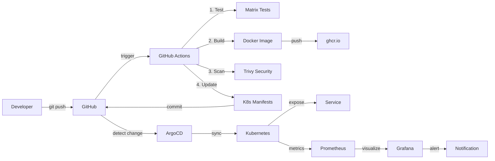

# DevOps Learning Roadmap - 5 Занятий

Структурированный план обучения DevOps с фокусом на CI/CD и GitOps.

---

## ОБЩАЯ СТРУКТУРА ПРОГРАММЫ

```
Урок 1: Git & GitHub Basics
   ↓
Урок 2: CI/CD Pipeline (GitHub Actions)  ← МЫ ЗДЕСЬ
   ↓
Урок 3: Kubernetes & Kustomize
   ↓
Урок 4: ArgoCD & GitOps
   ↓
Урок 5: Monitoring & Best Practices
```

---

## УРОК 1: Git & GitHub Basics

**Статус:** ✅ Завершен

**Длительность:** 2 часа

### Что закрыли:
- ✅ Git основы (clone, commit, push, pull)
- ✅ Branching strategies (main, feature branches)
- ✅ Pull Requests и Code Review
- ✅ Git best practices
- ✅ Markdown для документации

### Pet-проект:
- ✅ Создан Go Simple API
- ✅ Настроен GitHub репозиторий
- ✅ Написаны unit тесты
- ✅ Создан README с документацией

### Навыки после урока:
- Работа с Git локально и удаленно
- Создание и merge PR
- Понимание git workflow
- Базовые навыки Go для понимания кода

---

## УРОК 2: CI/CD Pipeline - GitHub Actions

**Статус:** 🎯 ТЕКУЩИЙ УРОК

**Длительность:** 2 часа

### Что закрываем:
- ✅ Проектирование пайплайна (с чего начать)
- ✅ Matrix strategies (параллельный запуск с разными параметрами)
- ✅ Caching зависимостей (ускорение builds)
- ✅ Docker build и push в registry
- ✅ GitHub Actions secrets и permissions
- ✅ Переиспользование кода (composite actions)
- ✅ Стратегии версионирования (SemVer, Docker tags)

### Pet-проект:
- ✅ Создан Dockerfile с multi-stage build
- ✅ Настроен CI/CD workflow (.github/workflows/ci-cd.yml)
- ✅ Matrix тестирование на 3 версиях Go
- ✅ Автоматический build и push в ghcr.io
- ✅ Security сканирование с Trivy

### Навыки после урока:
- Проектирование CI/CD пайплайнов
- Работа с GitHub Actions (triggers, jobs, steps)
- Оптимизация builds через caching
- Создание Docker образов production-ready
- Работа с Container Registry
- Security scanning базовый уровень
- Версионирование приложений

### Материалы:
- 📖 `LESSON-02.md` - теория и концепции
- 💻 `LESSON-02-PRACTICE.md` - практические задания
- 📋 `CHEATSHEET-LESSON-02.md` - шпаргалка

---

## УРОК 3: Kubernetes & Kustomize

**Статус:** 📅 Следующий урок

**Длительность:** 2 часа

### Что закроем:
- 🎯 Kubernetes основы (Pod, Deployment, Service)
- 🎯 YAML манифесты для приложения
- 🎯 Kustomize для управления конфигурациями
- 🎯 Overlays (dev, staging, prod)
- 🎯 ConfigMaps и Secrets в K8s
- 🎯 Health checks (Liveness, Readiness Probes)
- 🎯 Resource limits и requests

### Pet-проект:
- Создадим `k8s/` директорию с манифестами
- Настроим Kustomize структуру:
  - `base/` - базовые манифесты
  - `overlays/dev/` - конфигурация для dev
  - `overlays/prod/` - конфигурация для prod
- Развернем локально в Minikube или Kind

### Структура:
```
k8s/
├── base/
│   ├── deployment.yaml
│   ├── service.yaml
│   ├── configmap.yaml
│   └── kustomization.yaml
└── overlays/
    ├── dev/
    │   ├── kustomization.yaml
    │   └── deployment-patch.yaml  (1 replica)
    └── prod/
        ├── kustomization.yaml
        └── deployment-patch.yaml  (3 replicas)
```

### Навыки после урока:
- Понимание Kubernetes core concepts
- Написание K8s манифестов
- Использование Kustomize для DRY конфигураций
- Управление различными окружениями
- Локальное тестирование K8s
- Resource management

---

## УРОК 4: ArgoCD & GitOps

**Статус:** 📅 Планируется

**Длительность:** 2 часа

### Что закроем:
- 🎯 GitOps концепция и философия
- 🎯 ArgoCD установка и настройка
- 🎯 Создание ArgoCD Application
- 🎯 Sync strategies (Manual, Auto)
- 🎯 Rollback механизм
- 🎯 Multi-environment deployment
- 🎯 ArgoCD UI и CLI

### Pet-проект:
- Установим ArgoCD в K8s кластер
- Создадим ArgoCD Application для нашего API
- Настроим автоматическую синхронизацию
- Интегрируем CI/CD → ArgoCD workflow

### Workflow:
```
Developer → Git Push → GitHub Actions → Build Docker
                                      → Update K8s manifests
                                      → ArgoCD Auto Sync
                                      → Deploy to K8s
```

### ArgoCD Application пример:
```yaml
apiVersion: argoproj.io/v1alpha1
kind: Application
metadata:
  name: go-simple-api
spec:
  project: default
  source:
    repoURL: https://github.com/user/wit2-devops-project
    targetRevision: main
    path: k8s/overlays/dev
  destination:
    server: https://kubernetes.default.svc
    namespace: default
  syncPolicy:
    automated:
      prune: true
      selfHeal: true
```

### Навыки после урока:
- Понимание GitOps подхода
- Работа с ArgoCD (UI + CLI)
- Декларативное управление деплоями
- Автоматизация delivery процесса
- Rollback и recovery стратегии
- Multi-environment management
- Observability деплоев

---

## УРОК 5: Monitoring & Best Practices

**Статус:** 📅 Планируется

**Длительность:** 2 часа

### Что закроем:
- 🎯 Prometheus метрики (уже есть в коде)
- 🎯 Grafana дашборды
- 🎯 Logging (structured logs)
- 🎯 Alerting rules
- 🎯 Трейсинг (опционально)
- 🎯 Best practices CI/CD
- 🎯 Security best practices
- 🎯 Cost optimization

### Pet-проект:
- Развернем Prometheus + Grafana в K8s
- Создадим дашборд для мониторинга API
- Настроим алерты (CPU, Memory, Error rate)
- Интегрируем все в единый pipeline

### Метрики (уже есть в коде):
```go
// HTTP requests counter
http_requests_total{method="GET", endpoint="/health", status="200"}

// Request duration histogram
http_request_duration_seconds{method="GET", endpoint="/health"}

// App info
app_info{version="1.0.0", go_version="1.22"}
```

### Grafana Dashboard:
- Request Rate (RPS)
- Error Rate (%)
- Latency (P50, P95, P99)
- CPU & Memory usage
- Pod status

### Best Practices:
- **CI/CD:**
  - Fail fast принцип
  - Параллельные jobs где возможно
  - Кэширование агрессивно
  - Matrix для cross-platform
  - Security scanning обязательно

- **Docker:**
  - Multi-stage builds всегда
  - Минимальные base images (alpine, distroless)
  - Non-root user
  - Health checks
  - .dockerignore

- **Kubernetes:**
  - Resource limits/requests
  - Liveness/Readiness probes
  - Rolling updates
  - HPA (Horizontal Pod Autoscaler)
  - Network Policies

- **Security:**
  - Secrets в Vault или K8s Secrets
  - Image scanning (Trivy)
  - RBAC в K8s
  - Network Policies
  - Regular updates

### Навыки после урока:
- Мониторинг приложений (Prometheus + Grafana)
- Настройка алертинга
- Structured logging
- Performance optimization
- Security hardening
- Cost-aware архитектура
- Production-ready чеклист

---

## ИТОГОВЫЙ PIPELINE (после всех уроков)



---

## НАВЫКИ ПО ИТОГУ ПРОГРАММЫ

### Технические навыки:

**Git & Version Control:**
- ✅ Git workflow (feature branches, PR)
- ✅ Code review process
- ✅ Git best practices

**CI/CD:**
- ✅ GitHub Actions (triggers, jobs, matrix)
- ✅ Автоматизация тестирования
- ✅ Docker build automation
- ✅ Secrets management
- ✅ Security scanning

**Containerization:**
- ✅ Docker fundamentals
- ✅ Multi-stage builds
- ✅ Container Registry
- ✅ Image optimization

**Kubernetes:**
- 🎯 K8s core concepts
- 🎯 Workload management
- 🎯 Configuration management (Kustomize)
- 🎯 Service exposure

**GitOps:**
- 🎯 ArgoCD setup & usage
- 🎯 Declarative deployments
- 🎯 Automated sync
- 🎯 Rollback strategies

**Observability:**
- 🎯 Metrics (Prometheus)
- 🎯 Visualization (Grafana)
- 🎯 Logging best practices
- 🎯 Alerting

### Soft навыки:

- **Infrastructure as Code** мышление
- **Automation first** подход
- **Security awareness**
- **Troubleshooting** навыки
- **Documentation** культура
- **DevOps best practices**

---

## ПОЛЕЗНЫЕ РЕСУРСЫ

### Документация:
- [GitHub Actions Docs](https://docs.github.com/en/actions)
- [Docker Docs](https://docs.docker.com/)
- [Kubernetes Docs](https://kubernetes.io/docs/)
- [ArgoCD Docs](https://argo-cd.readthedocs.io/)
- [Prometheus Docs](https://prometheus.io/docs/)

### Инструменты:
- [act](https://github.com/nektos/act) - локальный запуск GitHub Actions
- [Minikube](https://minikube.sigs.k8s.io/) - локальный K8s
- [k9s](https://k9scli.io/) - K8s CLI UI
- [kubectx](https://github.com/ahmetb/kubectx) - переключение контекстов

### Книги:
- "The DevOps Handbook" - Gene Kim
- "Kubernetes in Action" - Marko Luksa
- "Docker Deep Dive" - Nigel Poulton

---

## ЧЕКЛИСТ ПРОГРЕССА

### После Урока 1:
- [ ] Понимаю Git workflow
- [ ] Могу создавать PR
- [ ] Написал базовые unit тесты
- [ ] Создал документацию

### После Урока 2:
- [ ] Создал CI/CD пайплайн
- [ ] Использую matrix testing
- [ ] Оптимизировал builds с cache
- [ ] Создал Docker образ < 20MB
- [ ] Настроил автопуш в registry
- [ ] Понимаю версионирование

### После Урока 3:
- [ ] Написал K8s манифесты
- [ ] Настроил Kustomize
- [ ] Развернул локально в Minikube
- [ ] Понимаю overlays для окружений

### После Урока 4:
- [ ] Установил ArgoCD
- [ ] Создал ArgoCD Application
- [ ] Настроил GitOps workflow
- [ ] Могу делать rollback

### После Урока 5:
- [ ] Настроил мониторинг
- [ ] Создал Grafana dashboard
- [ ] Настроил алерты
- [ ] Знаю best practices

---

## СЛЕДУЮЩИЕ ШАГИ

После завершения программы рекомендуется:

1. **Расширить проект:**
   - Добавить БД (PostgreSQL)
   - Настроить Helm charts
   - Multi-region deployment
   - Blue-Green или Canary deployments

2. **Углубиться в темы:**
   - Service Mesh (Istio/Linkerd)
   - Advanced monitoring (Jaeger, OpenTelemetry)
   - Chaos Engineering
   - Infrastructure as Code (Terraform)

3. **Практика:**
   - Создать свой pet-проект
   - Контрибьютить в Open Source
   - Участвовать в K8s сообществе

4. **Сертификация:**
   - CKAD (Certified Kubernetes Application Developer)
   - CKA (Certified Kubernetes Administrator)
   - GitHub Actions Certification

---

**Удачи в обучении! 🚀**
